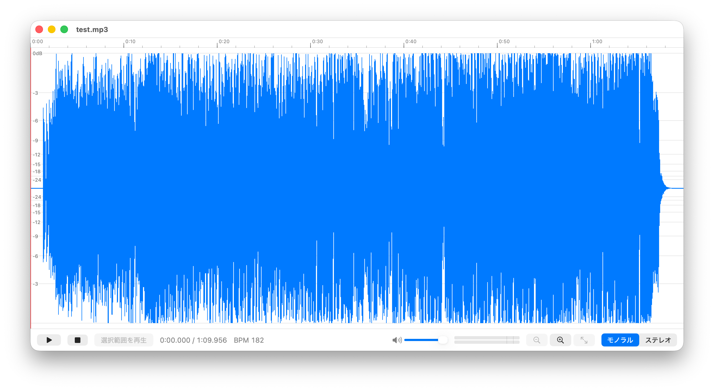
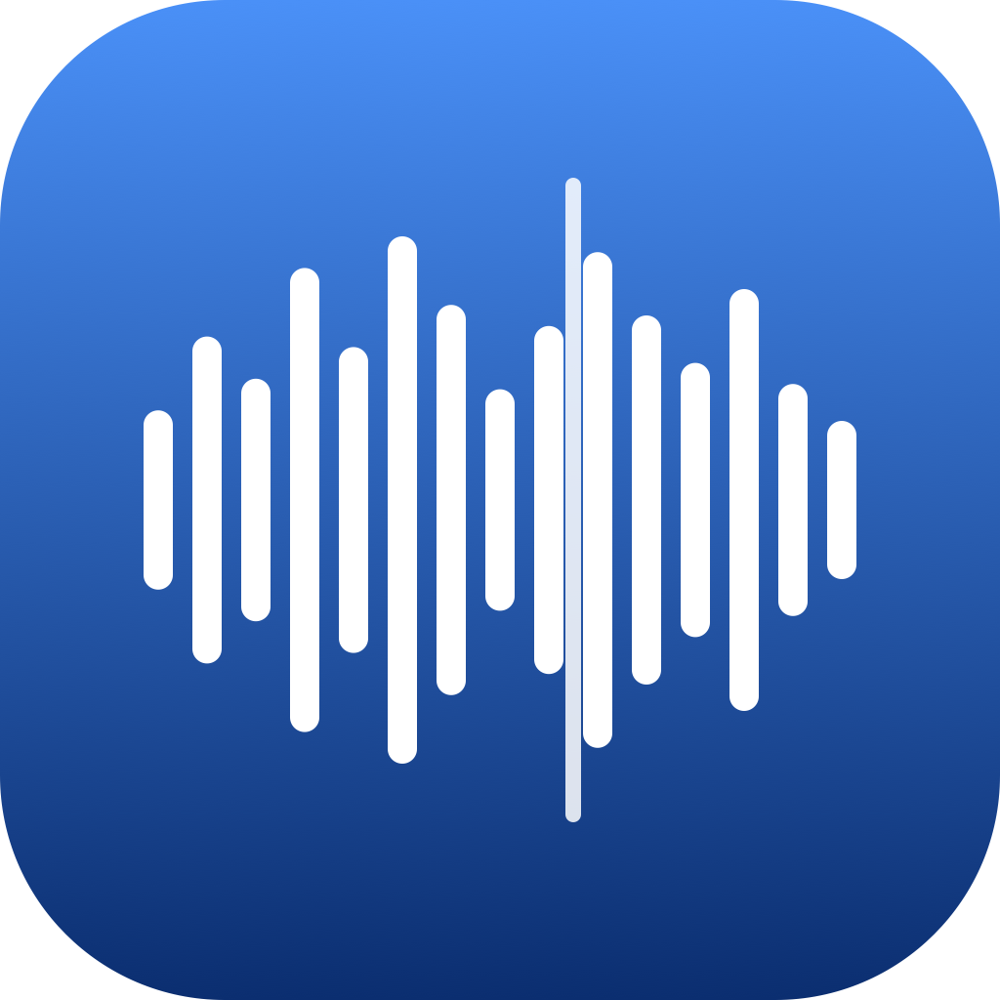

# WaveScope

音声ファイルの波形表示・再生を行う macOS アプリです(編集・保存機能なしのビューア)。





## 対応フォーマット

WAV / MP3 / AIFF / M4A / CAF / FLAC

## 主な機能

- **波形表示** — チャンネル別(ステレオ対応)の min/max ピーク波形。ズームインすると可視範囲だけをファイルから再デコードする二段構えの高解像度描画。
- **再生** — 全体再生・クリック位置からの再生・選択範囲のループしないサンプル精度の範囲再生。
- **範囲選択** — ドラッグで範囲選択し、その区間だけを再生。
- **ズーム / パン** — ⌥/⌘+スクロールやピンチでズーム、横スクロールでパン。
- **BPM 表示** — ファイルの BPM タグ、無ければ音声解析による推定値を表示。
- **レベルメーター** — 再生中のチャンネル別ピークレベル(dB)を 60fps で表示。
- **ボリューム調整** — スライダーで再生音量を調整(起動間で保持)。
- **カーソルチップ** — マウス位置の時刻とピーク dB を表示。
- **時間ルーラー** — ズームに応じて目盛り間隔が変化。

## 動作環境

- macOS 14 以降
- ビルドには Xcode 26 以降(Swift Testing / Icon Composer ドキュメントを使用)

## インストール(ダウンロードして使う)

プログラミングの知識は不要です。

1. [Releases ページ](https://github.com/cheebow/WaveScope/releases/latest)を開き、`WaveScope-x.y.z.zip` をダウンロードします。
2. ダウンロードした zip をダブルクリックして解凍し、出てきた `WaveScope.app` を「アプリケーション」フォルダに移動します。
3. `WaveScope.app` をダブルクリックして起動します(Apple の公証済みなので、そのまま開けます)。

## 使い方

### ファイルを開く

次のどれでも開けます:

- ウィンドウに音声ファイルを**ドラッグ&ドロップ**する
- メニューの「ファイル → 開く…」(**⌘O**)
- Finder で音声ファイルを右クリック →「このアプリケーションで開く」→ WaveScope

### 再生する

| 操作 | 動作 |
|---|---|
| **スペースキー** または ▶ ボタン | 再生 / 一時停止 |
| 波形を**クリック** | その位置から再生 |
| 波形を**ドラッグ** | 範囲を選択(「選択範囲を再生」ボタンでその区間だけ再生) |
| ■ ボタン | 停止 |
| スピーカーのスライダー | 音量調整(次回起動時も記憶されます) |

### 波形を拡大・縮小する

| 操作 | 動作 |
|---|---|
| **⌘ + / ⌘ −** または 🔍 ボタン | ズームイン / ズームアウト |
| **⌘0** | 全体を表示 |
| トラックパッドで**ピンチ** | ズーム |
| **⌥(または ⌘)を押しながら上下スクロール** | カーソル位置を中心にズーム |
| **横スクロール** | 波形を左右に移動 |

### その他

- 波形の上にマウスを置くと、その位置の**時刻とピークレベル(dB)**が表示されます。
- ステレオのファイルは、右上の「モノラル / ステレオ」切り替えで左右チャンネルを分けて表示できます。
- 再生中は右下のレベルメーターが動きます。

## ビルドと実行

```sh
cd WaveScope

# ビルド
xcodebuild -project WaveScope.xcodeproj -scheme WaveScope -configuration Debug -derivedDataPath build build

# 起動(ファイルを渡すと「このアプリで開く」経路で開く)
open -a "$(pwd)/build/Build/Products/Debug/WaveScope.app" ../TestAudio/test.wav
```

## テスト

```sh
cd WaveScope
xcodebuild test -project WaveScope.xcodeproj -scheme WaveScope -destination 'platform=macOS' -only-testing:WaveScopeTests
```

テスト音源はリポジトリに含まれません。リポジトリルートで以下を実行すると `TestAudio/` に各フォーマットのファイルが生成されます:

```sh
./Scripts/make-test-audio.sh        # 通常のテスト音源
./Scripts/make-test-audio.sh --long # 1時間の長尺ファイルも生成
```

## プロジェクト構成

```
WaveScope/WaveScope/
├── Core/        # SwiftUI 非依存の純粋レイヤー(ピーク抽出・波形描画)
│   ├── PeakExtractor.swift
│   ├── WaveformPeaks.swift
│   └── WaveformRenderer.swift
├── Views/       # SwiftUI ビュー(波形・トランスポート・レベルメーターなど)
├── AppModel.swift        # アプリ状態(ロード・選択・表示範囲)
├── PlayerController.swift # AVAudioEngine による再生制御
└── WaveScopeApp.swift
```

## ライセンス

[MIT License](LICENSE)
